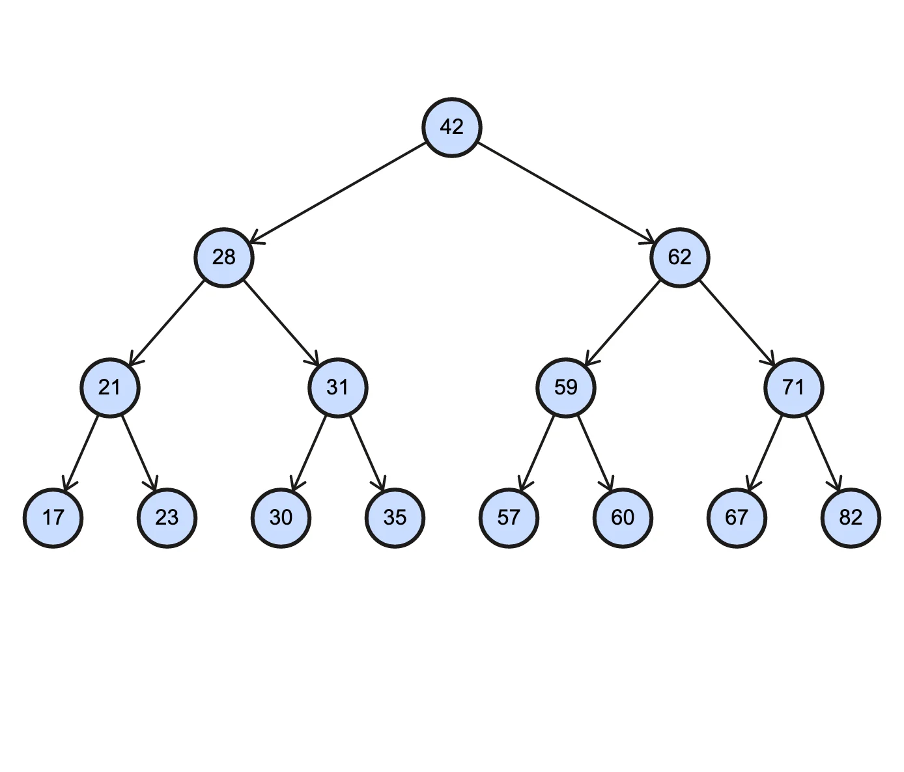
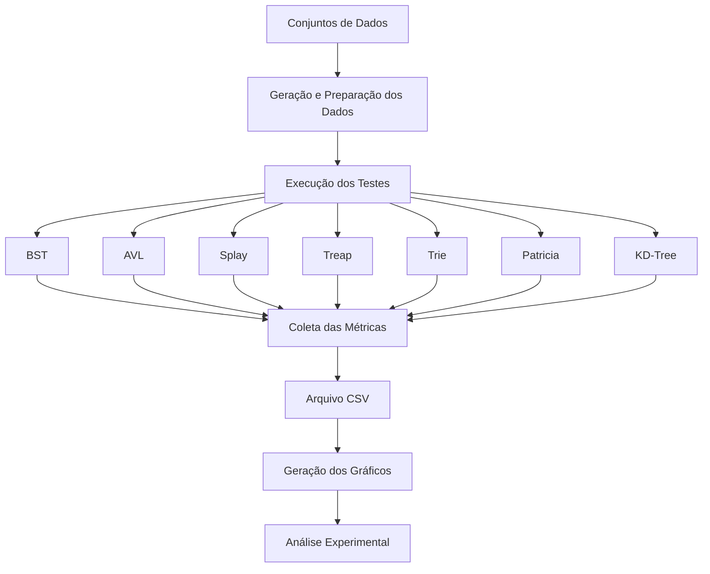

<div align="center">
  <h1>Estruturas em Árvore Avançadas</h1>
  
</div>

## 📗 Introdução
O implementação e a análise de desempenho de estruturas de dados em árvores avançadas foi proposta pelo professor Michel Pires da Silva para a disciplina de Algoritmos e Estruturas de Dados II do curso de Engenharia de Computação no Centro Federal de Educação Tecnológica de Minas Gerais (CEFET-MG) — Campus Divinópolis.

Este projeto apresenta a implementação e a análise experimental comparativa de sete estruturas de dados hierárquicas em C++17: **Árvore Binária de Busca (BST)**, **Árvore AVL**, **Árvore Splay**, **Árvore Treap**, **Árvore KdTree**, **Trie (Árvore de Prefixos)** e **Árvore Patricia (Radix Tree Compacta)**.

A pesquisa abrange desde árvores de busca clássicas e auto-balanceadas até estruturas especializadas para manipulação de strings e dados multidimensionais. Através de uma abordagem prática e experimental, o projeto combina a fundamentação teórica à geração de rastreamento visual de estados via Graphviz e simulação de cenários reais para compreender os limites operacionais e a eficiência de cada estrutura.

## 📋 Problema Proposto
O trabalho tem como proposta a **modelagem, implementação e análise comparativa de estruturas em árvore especializadas**.

Para cada estrutura, são estudados seus princípios de funcionamento e suas principais operações, considerando aspectos como:

- inserção;
- busca;
- remoção;
- organização dos elementos;
- balanceamento, quando aplicável;
- complexidade assintótica;
- comportamento em diferentes tipos de entrada.

Além da implementação, o projeto conta com testes individuais, aplicações, geração de conjuntos de dados, execução de experimentos, coleta de métricas e geração de gráficos.

O objetivo do projeto é avaliar o desempenho prático de cada estrutura diante de diferentes cenários de inserção, busca e remoção e de diferentes volumes e distribuições de dados, integrando fundamentação teórica, análise de complexidade assintótica, rastreamento visual das alterações estruturais via Graphviz e benchmarks práticos, que avalia o impacto do balanço estrutural, tempo de execução e consumo de recursos dessas estruturas.

> 📌 Os resultados completos dos experimentos, tabelas, gráficos e discussões são apresentados no **artigo técnico desenvolvido para o trabalho**. O artigo reúne a fundamentação teórica, a metodologia, a análise experimental e a discussão dos resultados obtidos.

O artigo está armazenado no diretório:

```text
docs/artigoArvores.pdf
```

---

## 📋 Estruturas Implementadas
- **BST (Binary Search Tree):** Árvore binária de busca padrão sem mecanismos de balanceamento.
- **AVL (Adelson-Velsky e Landis):** Árvore binária de busca auto-balanceada por altura através de rotações simples e duplas.
- **Splay Tree:** Árvore de busca auto-ajustável que move os elementos recentemente acessados para a raiz através do processo de *splaying*.
- **Treap (Tree + Heap):** Estrutura híbrida que mantém a propriedade de BST para as chaves e a propriedade de Max-Heap para prioridades geradas aleatoriamente.
- **KdTree (k-dimensional Tree):** Árvore de particionamento espacial para organização e busca rápida de pontos em $k$ dimensões (com foco em $k=2$).
- **Trie:** Árvore de prefixos para armazenamento e busca de cadeias de caracteres (strings).
- **Patricia Tree (Practical Algorithm to Retrieve Information Coded in Alphanumeric):** Trie compactada baseada em inspeção de bits para evitar nós redundantes de filho único.

---

## 📂 Organização do Repositório
```text
Trabalho-Arvores-AEDES2/
├── bin/
├── build/
├── data/
│   ├── datasets/
│   └── output/
│       ├── aplicacoes/
│       ├── dot/
│       ├── img/
│       │   ├── estados/
│       │   ├── graficos/
│       │   └── rastreio/
│       └── resultado_dados_comparativos.csv
├── docs/
├── scripts/
│   ├── app_kdtree.cpp
│   ├── app_patricia.cpp
│   ├── app_splay.cpp
│   ├── app_treap.cpp
│   ├── app_trie.cpp
│   ├── gerar_dados.py
│   ├── gerar_graficos.py
│   ├── test_avl.cpp
│   ├── test_bst.cpp
│   ├── test_kdtree.cpp
│   ├── test_patricia.cpp
│   ├── test_splay.cpp
│   ├── test_treap.cpp
│   └── test_trie.cpp
├── src/
│   ├── AVL/
│   ├── BST/
│   ├── ExecutorTestes/
│   ├── GerenciadorArquivos/
│   ├── KdTree/
│   ├── Patricia/
│   ├── Splay/
│   ├── Treap/
│   ├── Trie/
│   ├── VisualizacaoArvore/
│   └── main.cpp
├── Makefile
├── .gitignore
└── README.md
```

## 📥 Entrada de Dados

Os conjuntos de dados utilizados nos experimentos estão organizados no diretório:

```text
data/datasets/
```

O projeto possui diferentes tipos de entrada, incluindo:

- dados aleatórios;
- dados ordenados;
- dados decrescentes;
- dados espaciais para os experimentos com KD-Tree.

Entre os conjuntos disponíveis estão:

```text
int_aleatorio.dat
int_ordenado.dat
int_decrescente.dat

string_aleatorio.dat
string_ordenado.dat
string_decrescente.dat

kd_aleatorio.dat
kd_diagonal.dat
kd_clusterizado.dat
```

Os conjuntos de dados podem ser gerados por meio do script:

```bash
make gerar-dados
```
---

## 📤 Saída de Dados

Os resultados dos experimentos são armazenados no diretório:

```text
data/output/
```

Entre os arquivos gerados está:

```text
resultado_dados_comparativos.csv
```

Os resultados são armazenados em formato CSV, permitindo a posterior análise e geração de gráficos.

As métricas registradas incluem:

| Métrica | Descrição |
|---|---|
| `Dataset` | Conjunto de dados utilizado |
| `Estrutura` | Estrutura avaliada |
| `Operacao` | Operação realizada |
| `TamanhoN` | Tamanho da entrada |
| `TempoTotal_s` | Tempo total de execução |
| `TempoMedio_ns` | Tempo médio por operação |
| `Rotacoes` | Número de rotações realizadas, quando aplicável |
| `Comparacoes` | Número de comparações realizadas |
| `Memoria` | Informação de memória registrada |
| `Altura` | Altura da estrutura |
| `Dimensao` | Dimensão utilizada, quando aplicável |
| `Observacao` | Observação referente à execução |
---

## 🔄 Fluxo Geral do Projeto


---

## 🧪 Testes e Rastreamento Visual

Cada estrutura possui um programa de teste próprio, localizado no diretório `scripts/`.

```text
test_avl.cpp
test_bst.cpp
test_splay.cpp
test_treap.cpp
test_trie.cpp
test_patricia.cpp
test_kdtree.cpp
```

Os testes permitem verificar individualmente o comportamento das estruturas e de suas principais operações, que gera a visualização das árvores durante as operações.

---

## 💡 Aplicações Práticas

O projeto possui programas específicos para explorar aplicações das estruturas especializadas:

```text
app_splay.cpp
app_treap.cpp
app_trie.cpp
app_patricia.cpp
app_kdtree.cpp
```

Esses programas permitem analisar as estruturas em contextos de aplicação, complementando os testes individuais e os experimentos de desempenho.

---

## 👩🏽‍💻 Ambiente de criação e de testes
Para o desenvolvimento do código, foram utilizadas as seguintes ferramentas:
- **Sistema Operacional:** WSL 2.6.3.0 - Ubuntu 20.04.6 LTS (base Windows 11)
- **Compilador:** gcc 9.4.0
- **Editor:** VSCode 1.108.2
- **Linguagem:** C++ (C++17) e Python (Python 3.8.10)
- **Hardware:**
  - Notebook: LG Gram 15
  - CPU: Intel Core i7-8550U @ 1.80GHz (8 Núcleos)
  - RAM: 8 GB 

## 🔨🖥️ Compilação e Execução

### ✅ Pré-requisitos
>[!NOTE]
>Para garantir o funcionamento correto dos comandos do **Makefile**, é recomendado o uso de uma distribuição Linux ou do Windows Subsystem for Linux (WSL), ambientes nos quais o shell/bash está disponível.

**Instalar dependências**: <br><br>
Inicialmente, em ambiente shell, garanta que os seguintes comandos foram executados: 
- Atualiza os pacotes antes da instalação
```
sudo apt update
```
- Instala o compilador gcc, python e o Make, caso necessário
```
sudo apt install build-essential make python3
```
- Instala as bibliotecas Python utilizadas pelo projeto, caso necessário
```
sudo apt install python3-pip python3-pandas python3-matplotlib python3-seaborn
```

### 🛠️ Modo de Compilação
**Clone o repositório**:
```
git clone https://github.com/Ritaa-Marie/Trabalho-Arvores-AEDES2.git
cd Trabalho-Arvores-AEDES2
```
**Compile e execute o projeto**: <br><br>
Execute os seguintes comandos para limpar e compilar, respectivamente, o algoritmo
- Remove o executável anterior e a pasta build
```
make clean
```
- Ao compilar, será gerada a pasta build com o executável dentro
```
make
```

### 📊 Geração dos dados
Os experimentos utilizam diferentes conjuntos de dados e tamanhos de entrada, permitindo analisar o comportamento das estruturas em diferentes cenários.

```bash
make gerar-dados
```

Para compilar e executar os experimentos:
```bash
make run-tests
```

### 📈 Geração dos gráficos

```bash
make gerar-graficos
```

Os resultados gerados são armazenados no diretório:

```text
data/output/img/graficos
```

## 🧪 Execução dos Testes Individuais

```bash
make test-avl
make test-bst
make test-splay
make test-treap
make test-trie
make test-patricia
make test-kdtree
```

### Executar todos os testes

```bash
make test-all
```

Os resultados gerados (demonstração das operações na árvore) são armazenados no diretório:

```text
data/output/img/rastreio
```

## 💻 Execução das Aplicações

```bash
make splay-aplicacao
make treap-aplicacao
make trie-aplicacao
make patricia-aplicacao
make kdtree-aplicacao
```

### Executar todas as aplicações

```bash
make app-all
```

Os resultados gerados são armazenados no diretório:

```text
data/output/aplicacoes
```

## 🔗 Referências
REDDIT. **Imagem da árvore - Readme**. Disponível em: https://www.reddit.com/r/computerscience/comments/inzlzi/4_ways_to_traverse_a_binary_tree/?tl=pt-br. Acesso em: 19 set. 2026.<br>

## 🫱🏽‍🫲🏽 Créditos
Agradeço ao professor Michael Pires da Silva por todas as dúvidas sanadas. Agradeço também a todas as minhas amigas e aos meus amigos que me ajudaram a entender melhor a proposta.

## 📧 Contato
Autora: Rita Mariê Amaral Siqueira

- Email: ritamariecajuru@gmail.com
- GitHub: [Ritaa-Marie](https://github.com/Ritaa-Marie)
- Linkedin: [Rita Mariê](https://www.linkedin.com/in/rita-mari%C3%AA-amaral-siqueira-567b74357/)